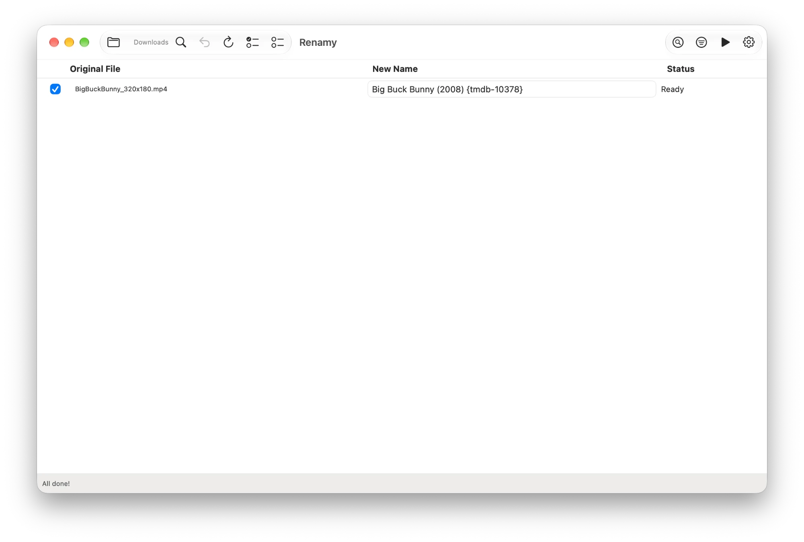
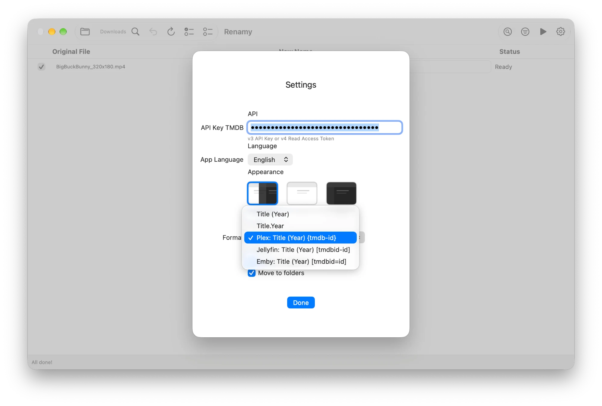

# Renamy 🎬


**Renamy** is a native macOS application developed in SwiftUI designed to help users manage, organize, and rename their personal video library files efficiently using official metadata.



> Renamy was previously called **Regia**. Settings are not migrated: re-enter your TMDB API Key after updating.

## ✨ Features
- **Smart Anchor Logic:** Intelligently identifies the movie or show title by detecting the year or season, cleaning up inconsistent filenames automatically.
- **Metadata Integration:** Connects to TMDB to retrieve official titles and release years for accurate cataloging.
- **TV Series Support:** Native recognition of standard season/episode numbering patterns (`SxxExx`), with a single choice for a whole season when a title is ambiguous.
- **Structured Organization:** Optional feature to move files into a standardized folder hierarchy, compatible with popular media servers.
- **Plex, Jellyfin & Emby Support:** Supports standardized naming conventions including identifiers (`{tmdb-id}` for Plex, `[tmdbid-id]` for Jellyfin).
- **Manual Search by ID:** Fix any match by title, TMDB ID (`#12345`, `tv:12345`, `movie:12345`) or a themoviedb.org link.
- **Drag & Drop:** Drop files or folders directly onto the window.
- **Disambiguation:** User interface to manually select the correct match when multiple titles are found.
- **Undo Capability:** Safety feature to revert the last rename or move operation instantly, including the folders it created.
- **Appearance:** System, Light and Dark themes.
- **Multi-language:** Native support for Italian 🇮🇹 and English 🇬🇧.



## 🚀 Requirements
- macOS 14.6 (Sonoma) or later.
- A personal [TMDB API Key](https://developer.themoviedb.org/docs/getting-started) (Free) is required to fetch metadata. Both the v3 API Key and the v4 Read Access Token are supported.

---

## 🍺 Installation via Homebrew (Recommended)

```bash
brew install --cask gionnio/renamy/renamy
```

### 🔄 Updating

```bash
brew upgrade --cask renamy
```

---

## 📥 Manual Installation (Pre-built App)

1. Go to the **[Releases](../../releases)** section of this page.
2. Download the latest `.zip` file (e.g., `Renamy_v2.0.1.zip`).
3. Unzip the file and move `Renamy.app` to your **Applications** folder.

### ⚠️ Important: How to open the app

Since this is an open-source project and not signed with a paid Apple Developer ID, macOS might block the first launch with a security warning ("App cannot be opened because the developer cannot be verified").

**To open it:**

1. **Right-click** (or Control+Click) on the `Renamy` icon.
2. Select **Open** from the context menu.
3. Click **Open** in the dialog box that appears.

If macOS still refuses to open it, go to **System Settings → Privacy & Security** and click **Open Anyway**.

*You only need to do this once. Subsequent launches will work normally.*

## 🛠 Build from Source

1. Clone the repository or download the source code.
2. Open `Renamy.xcodeproj` with Xcode.
3. Run the app (Cmd+R).
4. Open **Settings** and enter your TMDB API Key.

## 🚧 Roadmap & TODO

* [ ] **System Notifications:** Native macOS notifications when long processing tasks are finished.
* [ ] **Custom Renaming Format:** A custom pattern editor (e.g., `{title} - [{year}]`) beyond the built-in presets.
* [x] **Homebrew Support:** Install and update via `brew install --cask gionnio/renamy/renamy`.

## Privacy & Security

This application runs locally on your device. API Keys and file information are processed on your Mac and are never sent to external servers other than the official TMDB API for metadata retrieval.

## 🤖 AI Acknowledgment

This application was developed with the assistance of Artificial Intelligence for code generation, logic optimization, and problem-solving.

---

Created with AI, ❤️ and SwiftUI.
